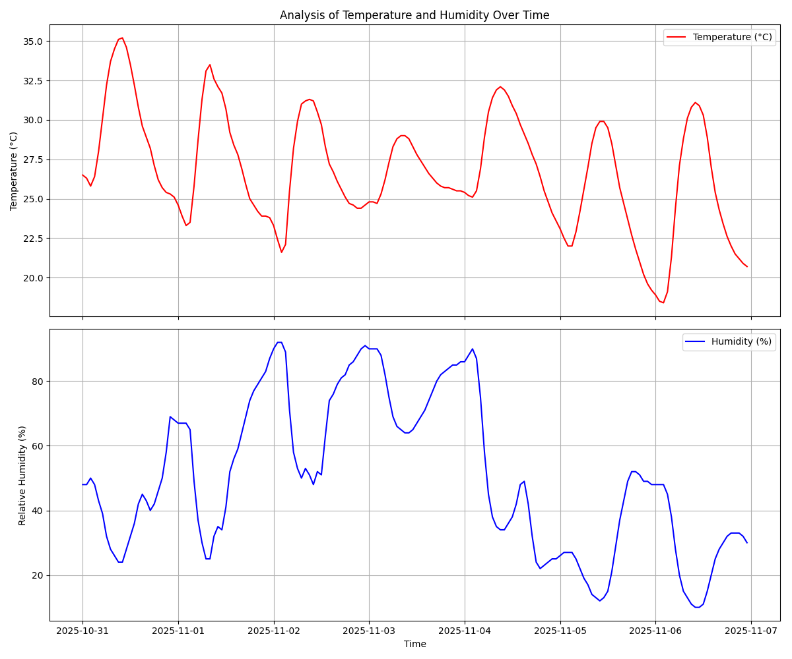

# Time-Series Weather Data Tracker

A Python-based application designed to fetch real-time environmental data (temperature and humidity) from a public API, process it as a time-series, and generate insightful visualizations. This project serves as a practical demonstration of data acquisition, manipulation, and visualization skills in Python.

## Project Overview

This script fetches hourly weather forecast data for a specific geographical location (defined by latitude and longitude). It then uses the powerful Pandas library to structure this data and Matplotlib to create clear, easy-to-understand graphs showing how temperature and humidity change over time.

## Sample Output

The script will generate and display a plot similar to the one below, and save it as `weather_data_visualization.png` in the project directory.


*(Note: You will need to run the script once to generate this image in your repository.)*

## Features

- **Real-time Data Acquisition:** Fetches up-to-date hourly weather data from the Open-Meteo API.
- **Data Processing:** Utilizes Pandas to efficiently handle and structure the time-series data.
- **Data Visualization:** Generates dual-axis plots with Matplotlib to visualize temperature and humidity trends.
- **Customizable Location:** Easily configurable to track weather for any location worldwide by changing latitude and longitude coordinates.
- **Error Handling:** Includes basic error handling for API requests.
- **Reproducible Environment:** Comes with a `requirements.txt` file for easy setup.

## Technologies Used

- **Python 3**
- **Libraries:**
  - `requests`: For making HTTP requests to the weather API.
  - `pandas`: For data manipulation and analysis.
  - `matplotlib`: For creating static, animated, and interactive visualizations.

## Setup and Installation

Follow these steps to get the project running on your local machine.

**1. Clone the Repository:**
```bash
git clone https://github.com/your-username/your-repository-name.git
cd your-repository-name
